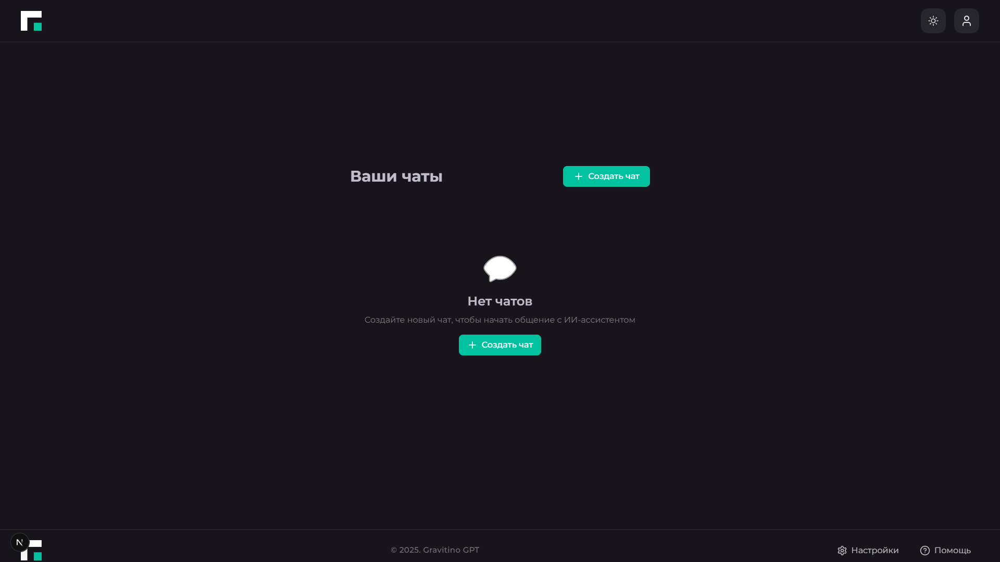

# 🤖 AI-Chatbot — умный ИИ-поисковик для ООО "Гравитон"


## 🚀 О проекте

AI-Chatbot — это современный фронтенд для умного ИИ-поисковика товаров компании "ООО Гравитон".  
Проект реализован на Next.js, React, TypeScript, Zustand, React Query, TailwindCSS и поддерживает real-time обмен сообщениями через Socket.IO.

### Основные возможности

- 🔐 Аутентификация и регистрация пользователей
- 💬 Список чатов и интерфейс общения
- ⚡️ Мгновенные сообщения через Socket.IO
- 🗂 Архивация, удаление и восстановление чатов
- 📁 Загрузка и отображение файлов в сообщениях
- 🧑‍💼 Административный функционал (для роли ADMIN)
- 🌙 Поддержка темной темы и адаптивная верстка

## 🏗️ Архитектура и технологии

- **Zustand** — основной state-менеджер для бизнес-логики и UI.
- **React Query** — используется для отдельных задач асинхронного кэширования (миграция на Zustand в процессе).
- **Socket.IO** — полностью заменил WebSocket для real-time обмена сообщениями.
- **Axios** — для HTTP-запросов (см. [`frontend/src/shared/api/api-client.ts`](frontend/src/shared/api/api-client.ts) и [`frontend/src/shared/api/api.ts`](frontend/src/shared/api/api.ts)).
- **Документирование** — каждый модуль содержит подробный `README.md` и докстринги в коде. [Гайд по стилю документации](DOCUMENTATION_STYLE.md)

## 📦 Технологии

- [Next.js](https://nextjs.org/)
- [React](https://react.dev/)
- [TypeScript](https://www.typescriptlang.org/)
- [Zustand](https://zustand-demo.pmnd.rs/)
- [React Query](https://tanstack.com/query/latest)
- [TailwindCSS](https://tailwindcss.com/)
- [Sonner](https://sonner.emilkowal.ski/) (toast-уведомления)
- [Socket.IO](https://socket.io/) (real-time)
- [Axios](https://axios-http.com/)

## 🛠️ Быстрый старт

```bash
git clone https://github.com/MindlessMuse666/ai-chatbot.git
cd ai-chatbot/frontend
npm install
npm run dev
```

Для запуска mock Socket.IO сервера:
```bash
cd frontend
npm run mock-server
```

## 🛠️ Изменения и best practices (июнь 2025)

### 09.06
- Проведён рефакторинг структуры: директории `@/widgets/sidebar` и `@/widgets/administation-tabs` перенесены в `@/features/sidebar` и `@/features/administration`.
- Объединены и обновлены README.md для модулей sidebar и administration.
- Улучшена документация: добавлены докстринги, примеры использования, описания структуры.
- Обновлены импорты по всему проекту на новые пути.
- Приведён код к единому стилю согласно документационному гайду.

- Используется MSW для мокирования HTTP API в dev-режиме (`frontend/src/mocks/handlers.ts`).
- Все пользователи (включая админа) теперь хранятся в localStorage (`msw-users`), что обеспечивает кросс-сессионое хранение и корректную работу logout/login.
- Для logout используется централизованная логика через Zustand store и useAuthGuard, ручной редирект на логин больше не используется.
- Для предотвращения двойных тостов используется уникальный id в sonner/toast (см. auth-модуль).
- В dev-режиме все запросы к статике и Next.js-ресурсам автоматически пропускаются MSW (через `onUnhandledRequest: 'bypass'`).
- Меню управления чатом (троеточие) вынесено в отдельный компонент Popover, улучшен UX для архивирования/удаления чатов, исправлены визуальные баги и сообщения тостов.
- Подробнее о best practices — см. документацию в коде и модульных README.

## 🖼️ Демонстрация

> _Скриншоты интерфейса:_





- Современный UI: анимированный сайдбар с тултипами, плавные переходы, современный футер в стиле header.
- Карточки чатов и кнопки — интерактивные, с плавными hover/active-эффектами.
- Полная адаптивность и поддержка тёмной темы.

## 📄 Техническое задание

Примерное ТЗ доступно в файле [REQUIREMENTS-SPECIFICATION-GRAVITON.md](REQUIREMENTS-SPECIFICATION-GRAVITON.md "Техническое задание").

## 📚 Документирование и best practices

- Каждый модуль содержит свой `README.md` с описанием структуры, компонентов и примерами.
- В коде используются докстринги для всех публичных функций и компонентов.
- [Гайд по стилю документации и коммитам](frontend/DOCUMENTATION_STYLE.md)

## 📝 Лицензия

Этот проект распространяется под лицензией MIT. Подробности в файле [LICENSE](LICENSE "Лицензия").

## 👥 Авторы

FrierenWay
- [GitHub](https://github.com/FrierenWay "Александра: github.com/FrierenWay")
- [Telegram](t.me/NebbiaQ "@NebbiaQ")

RoudgerLRG
- [GitHub](github.com/RoudgerGot "Анастасия: github.com/RoudgerGot")
- [Telegram](t.me/Fukkazzumi "@Fukkazzumi")

MindlessMuse666
- [GitHub](https://github.com/MindlessMuse666 "Владислав: github.com/MindlessMuse666")
- [Telegram](t.me/mindless_muse "@mindless_muse")
- [Gmail](mindlessmuse.666@gmail.com "mindlessmuse.666@gmail.com")

## 🙏 Благодарности

Next.js, React, Zustand, React Query, TailwindCSS, Sonner, Socket.IO, Axios и всем авторам open-source библиотек!