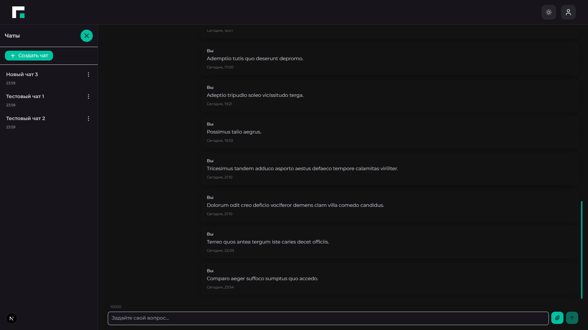
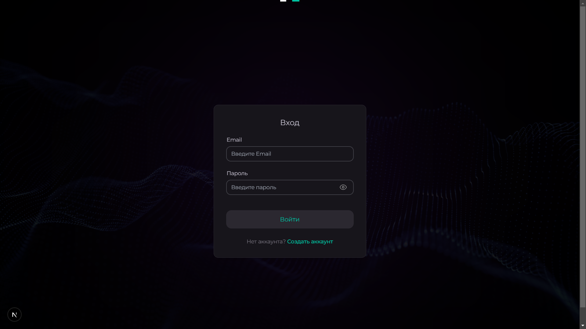
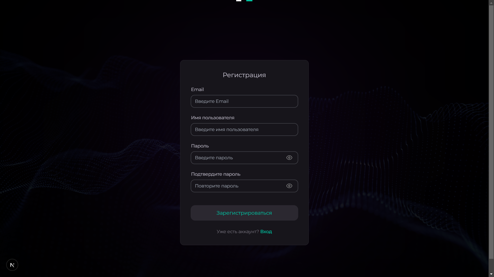
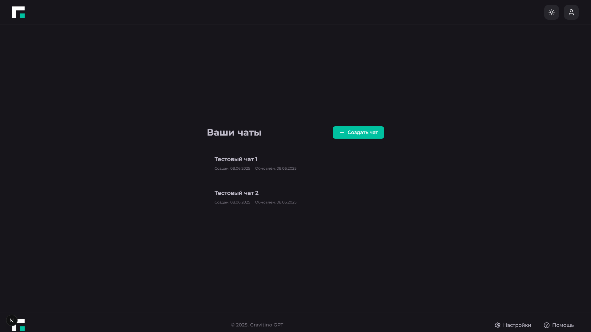

# 🤖 AI-Chatbot — умный ИИ-поисковик для ООО "Гравитон"



## 🚀 О проекте

AI-Chatbot — это современный фронтенд для умного ИИ-поисковика товаров компании "ООО Гравитон".  
Проект реализован на Next.js, React, TypeScript, Zustand, React Query, TailwindCSS и поддерживает real-time обмен сообщениями через WebSocket.

### Основные возможности

- 🔐 Аутентификация и регистрация пользователей
- 💬 Список чатов и интерфейс общения
- ⚡️ Мгновенные сообщения через WebSocket
- 🗂 Архивация, удаление и восстановление чатов
- 📁 Загрузка и отображение файлов в сообщениях
- 🧑‍💼 Административный функционал (для роли ADMIN)
- 🌙 Поддержка темной темы и адаптивная верстка

## 📦 Технологии

- [Next.js](https://nextjs.org/)
- [React](https://react.dev/)
- [TypeScript](https://www.typescriptlang.org/)
- [Zustand](https://zustand-demo.pmnd.rs/)
- [React Query](https://tanstack.com/query/latest)
- [TailwindCSS](https://tailwindcss.com/)
- [Sonner](https://sonner.emilkowal.ski/) (toast-уведомления)
- [ws](https://github.com/websockets/ws) (mock WebSocket сервер)

## 🛠️ Быстрый старт

```bash
git clone https://github.com/MindlessMuse666/ai-chatbot.git
cd ai-chatbot/frontend
npm install
npm run dev
```

Для запуска mock WebSocket сервера:
```bash
cd frontend
npm run mock-server
```

## 🖼️ Демонстрация

> _Скриншоты интерфейса:_






_(В будущем будет доступна онлайн-демо-версия на отдельном домене)_

## 📄 Техническое задание

Примерное ТЗ доступно в файле [REQUIREMENTS-SPECIFICATION-GRAVITON.md](REQUIREMENTS-SPECIFICATION-GRAVITON.md "Техническое задание").

## 📝 Лицензия

Этот проект распространяется под лицензией MIT. Подробности в файле [LICENSE](LICENSE "Лицензия").

## 👥 Автор

MindlessMuse666
- [GitHub](https://github.com/MindlessMuse666 "Владислав: github.com/MindlessMuse666")
- [Telegram](t.me/mindless_muse "@mindless_muse")
- [Gmail](mindlessmuse.666@gmail.com "mindlessmuse.666@gmail.com")

## 🙏 Благодарности

Next.js, React, Zustand, React Query, TailwindCSS, Sonner, ws и всем авторам open-source библиотек!
